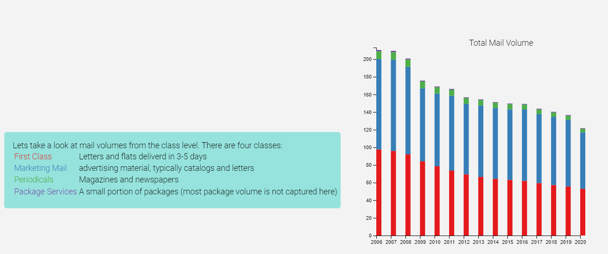

# scrollyTelling-USPS

Interactive scrolling data viz on the decline of mail volumes in the US

As the user scrolls, animated bars display the total decline in mail volume by year while animated text explains factors that contributed to mail decline in that year.

Towards the bottom of the page, the visualization gets more detailed displaying mail volume by mail class. The final stage of the visualization shows every mail product in years 2008 and 2020. This stage allows users to hover over each block (representing a single product). Hovering over a product in the 2008 portion of the visualization will highlight the same product in 2020, showing the total decline in every single product over a 12 year period.

It looks like this:

